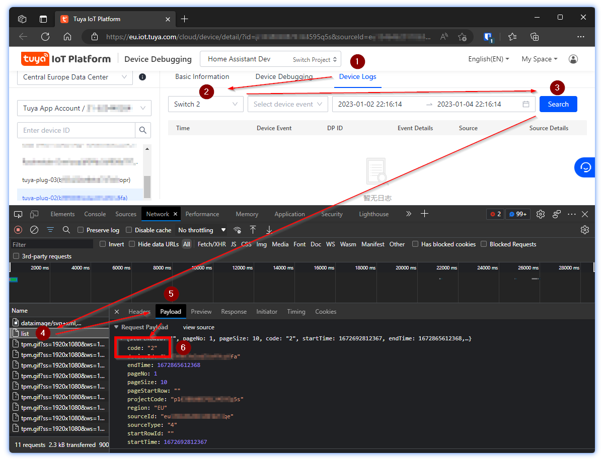

# LocalTuya Device Datapoints

Early 2023, adding/configuring Tuya devices in the Home Assistant [LocalTuya](https://github.com/rospogrigio/localtuya) community add-on is (still) a rather confusing process. Adding a device involves manually configuring properties using Data Points, which are the properties a Tuya device exposes through its local API.  

These properties do not advertise themselves using a friendly name or data type, but as numbers. Finding what property these DPs represent is quite cumbersome, hence I created this repo to remind me of this process and also include the DPs for several of my Tuya devices to save future me from having to look them up (again).

## Obtaining data points for your Tuya device


1. Login to the [Tuya IoT Platform](https://iot.tuya.com/)
2. Select '**Cloud**' > '**Development**' from the menu
3. Select your project
4. Goto '**Devices**'
5. Click **Debug device** in the *Operations* column
6. Select '**Device Logs**' tab
7. Open the browser Developer Tools (F12) and open the Network tab
8. Select a DP from the '**Select DP ID**' dropdown
9. Hit '**Search**'

In the background a network request will be done, available as `'list'` in the network calls overview.  
Select that request and open the 'Payload' tab.

The payload will look similar to this:
```json
{
  "startRowId": "",
  "pageNo": 1,
  "pageSize": 10,
  "code": "2",
  "startTime": 1672692811363,
  "endTime": 1672865611364,
  "projectCode": "*****",
  "sourceId": "*****",
  "sourceType": "4",
  "deviceId": "*****",
  "pageStartRow": "",
  "region": "EU"
}
```

The `"code"` value is your DP ID. In this case `2`, which translates to the `'Switch 2'` the relay for socket #2 of the *Blitzwolf SHP7* smart socket.

Once the device has been selected, the flow will be like this:



# Device DPs

## Blitzwolf SHP5

| DP  | Description        | Value        |
| --- | ------------------ | ------------ |
| 1   | Switch 1           | {true,false} |
| 7   | Switch 2 (USB)     | {true,false} |
| 9   | Countdown Switch 1 | 0-86400 s    |
| 15  | Countdown Switch 2 | 0-86400 s    |
| 17  | Add Electricity*   | 0-50000 kWh  |
| 18  | Current            | 0-30000 mA   |
| 19  | Power              | 0-5000 W     |
| 20  | Voltage            | 0-50000 V    |
| 21  | Test Bit           |              |
| 22  | Voltage coe        |              |
| 23  | Electric coe       |              |
| 24  | Power coe          |              |
| 25  | Electricity coe    |              |
| 26  | Fault              |              |

> **Add Electricity** = Power consumption since last report

## Blitzwolf SHP7

| DP  | Description        | Value                                |
| --- | ------------------ | ------------------------------------ |
| 1   | Switch 1           | {true,false}                         |
| 7   | Switch 2 (USB)     | {true,false}                         |
| 9   | Countdown Switch 1 | 0-86400 s                            |
| 10  | Countdown Switch 2 | 0-86400 s                            |
| 17  | Add Electricity*   | 0-50000 kWh                          |
| 18  | Current            | 0-30000 mA                           |
| 19  | Power              | 0-5000 W                             |
| 20  | Voltage            | 0-50000 V                            |
| 21  | Test bit           |                                      |
| 22  | Voltage coe        |                                      |
| 23  | Electric coe       |                                      |
| 24  | Power coe          |                                      |
| 25  | Electricity coe    |                                      |
| 38  | Relay Status       | { "power_off", "power_on",  "last" } |
| 39  | Indicator Light    | { "none", "relay", "pos" }           |
| 40  | Child Lock         | {true,false}                         |
| 41  | Cycle Time         |                                      |
| 42  | Random Time        |                                      |
| 43  | Inching Switch     |                                      |

### CountdownObject

```json
{
  "unit": "s",
  "min": 0,
  "max": 86400,
  "scale": 0,
  "step": 1
}
```

## Tuya v3.3 DPs

List of DPs for Tuya v3.3 devices.  
Reference: https://pypi.org/project/tinytuya/

| DP ID | Function Point     | Type    | Range	Units                   |
| ----- | ------------------ | ------- | ----------------------------- |
| 1     | Switch 1           | bool    | True/False                    |
| 2     | Switch 2           | bool    | True/False                    |
| 3     | Switch 3           | bool    | True/False                    |
| 4     | Switch 4           | bool    | True/False                    |
| 5     | Switch 5           | bool    | True/False                    |
| 6     | Switch 6           | bool    | True/False                    |
| 7     | Switch 7/usb       | bool    | True/False                    |
| 9     | Countdown 1        | integer | 0-86400 s                     |
| 10    | Countdown 2        | integer | 0-86400 s                     |
| 11    | Countdown 3        | integer | 0-86400 s                     |
| 12    | Countdown 4        | integer | 0-86400 s                     |
| 13    | Countdown 5        | integer | 0-86400 s                     |
| 14    | Countdown 6        | integer | 0-86400 s                     |
| 15    | Countdown 7        | integer | 0-86400 s                     |
| 17    | Add Electricity    | integer | 0-50000 kw                    |
| 18    | Current            | integer | 0-30000 mA                    |
| 19    | Power              | integer | 0-50000 W                     |
| 20    | Voltage            | integer | 0-5000 V                      |
| 21    | Test Bit           | integer | 0-5 n/a                       |
| 22    | Voltage coeff.     | integer | 0-1000000                     |
| 23    | Current coeff.     | integer | 0-1000000                     |
| 24    | Power coeff.       | integer | 0-1000000                     |
| 25    | Electricity coeff. | integer | 0-1000000                     |
| 26    | Fault	fault	ov_cr  |         |                               |
| 38    | Power-on state     | setting | enum { off, on, memory }      |
| 39    | Overcharge Switch  | bool    | True/False                    |
| 40    | Indicator status   | setting | enum { none, on, relay, pos } |
| 41    | Child Lock         | bool    | True/False                    |
| 42    | UNKNOWN            |         |                               |
| 43    | UNKNOWN            |         |                               |
| 44    | UNKNOWN            |         |                               |
